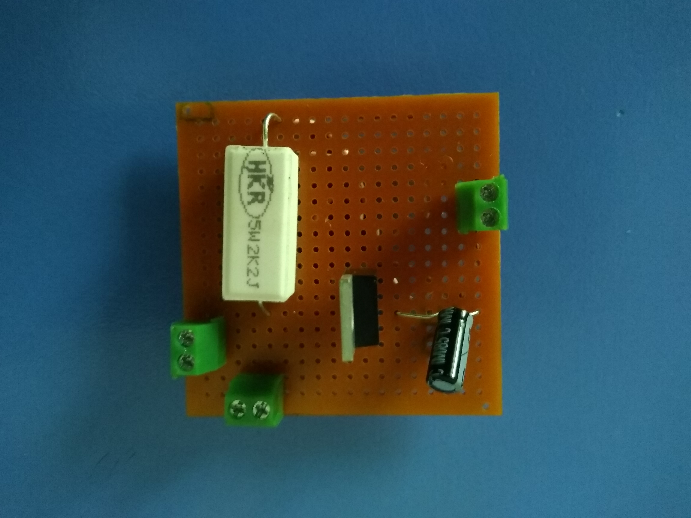
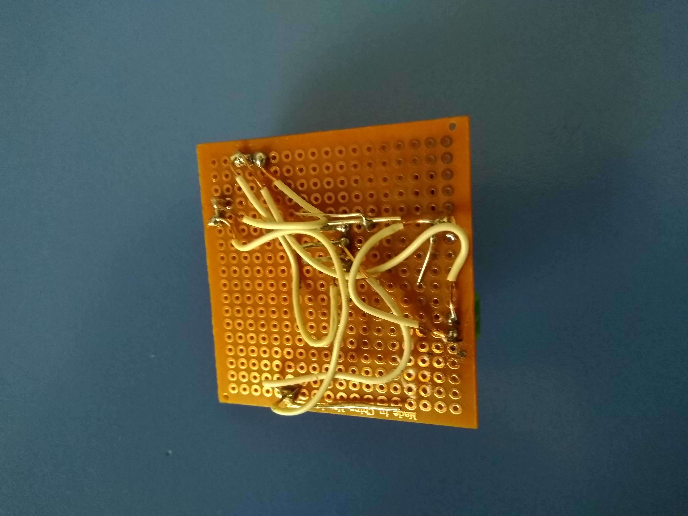
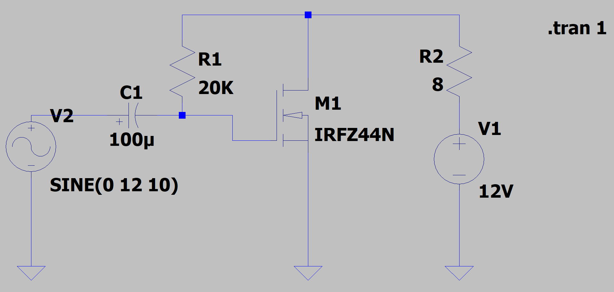

## Sound Amplifier

A basic and powerful mono sound amplifier

Copyright (C) 2020-2021 Ercan Ersoy

This project licensed under MIT License.

# Front of the Hardware

# Back of the Hardware

# Schematic

Circuit schematic created via LTSpice.

# Components

* 1 x IRFZ44N MOSFET
* 100 uF Capacitor
* 20K 5W Resistor
* 3 Electric Terminal
* 1 Stripboard

# Notes

It uses 6V DC current.

## Source

https://circuitspedia.com/simple-powerful-audio-amplifier-circuit-design-using-single-mosfet/
